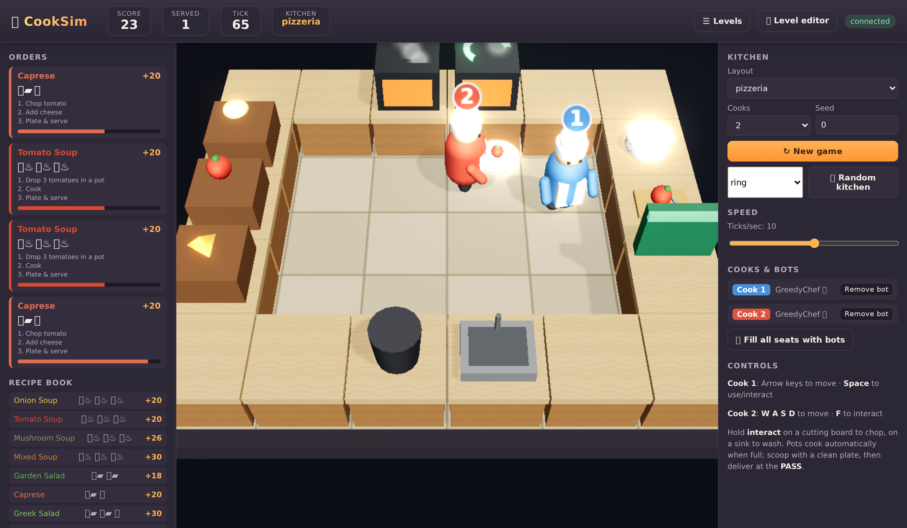
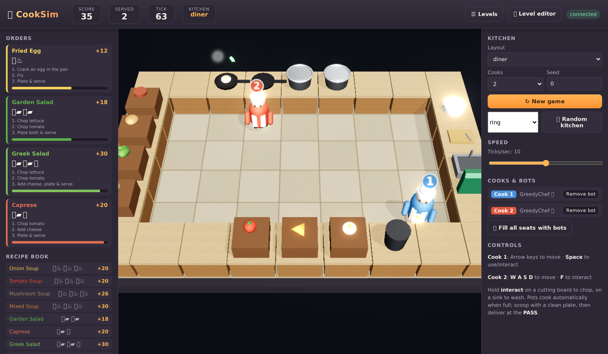
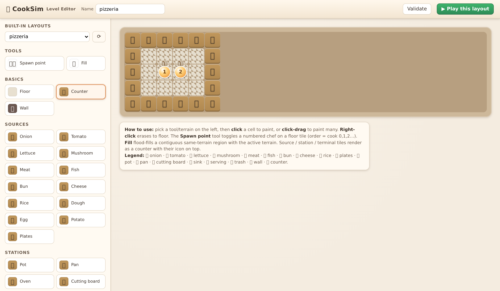

# 🍳 CookSim

**A high-fidelity, richly-featured Overcooked-style cooking simulator** — built as a
better alternative to [`overcooked_ai`](https://github.com/HumanCompatibleAI/overcooked_ai):
wider game mechanics, far better visuals, a level editor, procedural kitchens, and
first-class RL support (Gymnasium **and** PettingZoo).



> A guided, teach-a-student walkthrough of the whole project lives in [`site/index.html`](site/index.html).

---

## Why CookSim?

| | `overcooked_ai` | **CookSim** |
|---|---|---|
| Recipes | 1 (onion soup) | **19** soups, salads, burgers, sushi, pizza, fried dishes, rice bowls — easily extended |
| Ingredients | onion, tomato, dish | **12 ingredients** + plates, with raw/chopped/cooked/**burnt** states |
| Stations | pot, dispensers, serving | pots, **pans**, **ovens**, **cutting boards**, **sinks (washing)**, dispensers, serving, **trash** |
| Mechanics | cook + deliver | cooking, **baking**, **burning**, chopping, **dish-washing**, **timed customer orders**, multi-step assembly |
| Players | 2 | **1–N** configurable |
| Maps | fixed text layouts | text layouts **+ procedural generation + a visual level editor** |
| Rendering | basic pygame tiles | **Real-time 3D (WebGL / Three.js)**: shadow-mapped lighting, reflective steel (IBL), ACES tone-mapping, bloom, steam/fire/sparkle particles |
| RL API | custom + Gym shim | native **Gymnasium** *and* **PettingZoo ParallelEnv** (API-test clean) |

<p align="center">
  
  
</p>

---

## Install

CookSim ships with a conda/mamba environment file.

```bash
# with conda or mamba/micromamba
conda env create -f environment.yml
conda activate cooksim
# (the env file already runs `pip install -e .`)
```

Or with plain pip:

```bash
pip install -e ".[server]"
```

Core RL use only needs `numpy`, `gymnasium`, `pettingzoo`. The browser front-end
additionally needs the `server` extra (FastAPI + uvicorn + websockets).

---

## Play in the browser

```bash
cooksim-server                 # or: python -m cooksim.server.app
# open http://127.0.0.1:8000
```

* **Cook 1**: arrow keys to move, **Space** to use/interact.
* **Cook 2**: `WASD` to move, **F** to interact (local co-op on one keyboard).
* Add **GreedyChef bots** to any seat, change layout, spawn a **random kitchen**,
  or adjust simulation speed — all from the right-hand panel.
* Pots cook automatically when full; scoop with a clean plate and deliver at the **PASS**.
  Hold *interact* on a cutting board to chop, on a sink to wash dirty plates.

### Level editor

Open **http://127.0.0.1:8000/editor**. Paint tiles, place spawn points, resize the
grid, validate, procedurally generate, import/export JSON, then hit **▶ Play this
layout** to drop straight into the game with your kitchen.

---

## Reinforcement learning

### PettingZoo (multi-agent, canonical)

```python
from cooksim.envs import CookSimParallelEnv

env = CookSimParallelEnv(layout="open_kitchen", reward_mode="shared", seed=0)
obs, info = env.reset(seed=0)
while env.agents:
    actions = {a: env.action_space(a).sample() for a in env.agents}
    obs, rewards, terms, truncs, infos = env.step(actions)
```

* `observation_space(agent)` is a `Dict` of `{"grid": Box(C,H,W), "orders": Box(...), "time": Box(1)}`.
  The grid is a fully-observable multi-channel encoding (terrain, self/teammates,
  held items, pot/board/sink state). See `cooksim/envs/observation.py`.
* `action_space(agent)` is `Discrete(6)`: `NORTH, SOUTH, EAST, WEST, INTERACT, STAY`.
* `reward_mode`: `"shared"` (common-payoff, the Overcooked default) or `"individual"`.
* Passes `pettingzoo.test.parallel_api_test`.

### Gymnasium (single-agent vs. a fixed partner)

```python
from cooksim.envs import CookSimGymEnv, RandomPartner
import gymnasium as gym

env = CookSimGymEnv("cramped_room", partner_policy=RandomPartner(), seed=0)
# also registered: gym.make("CookSim-v0")
obs, _ = env.reset()
obs, reward, terminated, truncated, info = env.step(env.action_space.sample())
```

Pass `procedural={"width": 11, "height": 7, "style": "ring"}` to either env to train
on a fresh random kitchen each reset.

### Reward shaping

`GameConfig.shaped_rewards` adds dense signals (`place_in_pot`, `useful_chop`,
`soup_pickup`, …) on top of the sparse delivery reward. Turn off with
`GameConfig(use_shaped_rewards=False)` for pure sparse evaluation.

---

## Programmatic core (no RL, no server)

```python
from cooksim import KitchenGame, load_layout, GameConfig
from cooksim.agents import GreedyChef

g = KitchenGame(load_layout("bistro"), config=GameConfig(horizon=1500), seed=0)
bots = [GreedyChef(seed=i) for i in range(g.n_players)]
while not g.done:
    g.step([bot(g, i) for i, bot in enumerate(bots)])
print(g.score, dict(g.stats))
state = g.render_state()   # JSON-serializable full state (what the renderer consumes)
```

---

## Layouts

Built-in: `cramped_room`, `forced_coordination`, `open_kitchen`, `bistro`, `burger_bar`,
`pizzeria`, `diner` (`cooksim.list_layouts()`). Text-layout grammar (one char per cell):

```
' ' floor   X counter   # wall
O onion  T tomato  L lettuce  M mushroom  E meat  F fish  B bun  C cheese  R rice
G dough  Z egg  Y potato
D plates  P pot  A pan  N oven  / cutting-board  W sink  S serving  U trash   1-9 cook spawns
```

```python
from cooksim import generate_layout
lay = generate_layout(width=11, height=7, n_players=2, style="divided", seed=7)
print("\n".join(lay.to_lines()))
```

`style="ring"` (counters around an open interior) or `"divided"` (a central counter
wall — the classic forced-coordination topology).

---

## Architecture

```
cooksim/
  core/        engine: enums, items, recipes, stations, orders, layout, game (step logic)
  envs/        Gymnasium + PettingZoo wrappers and the observation encoder
  agents/      RandomAgent + GreedyChef (BFS-planning heuristic)
  layouts/     built-in kitchens
  server/      FastAPI + WebSocket live session + REST (layouts/recipes/validate/generate)
web/           Three.js 3D renderer (render3d.js), client (game.js), and level editor
examples/      random rollout, greedy benchmark, procedural + custom layout demos
tests/         pytest suite (core mechanics + env API conformance + determinism)
```

The `KitchenGame` core is renderer- and framework-agnostic. The RL wrappers and the
WebSocket server are thin shells around it, and the browser renders the exact
`render_state()` dict the engine emits.

---

## Run the tests / examples

```bash
pytest -q
python examples/greedy_demo.py          # heuristic benchmark across all layouts
python examples/random_rollout.py       # PettingZoo random rollout
python examples/procedural_and_custom.py
```

## Notes

* The `GreedyChef` heuristic is a simple uncoordinated planner (great solo; it doesn't
  do cross-counter handoffs, so `forced_coordination` needs a real cooperative policy).
* The 3D renderer builds every mesh and texture procedurally (no downloaded art assets), so it's fully
  self-contained. It needs a WebGL2-capable browser. Emoji used in the HUD/editor labels rely on the OS emoji font.

MIT licensed.
